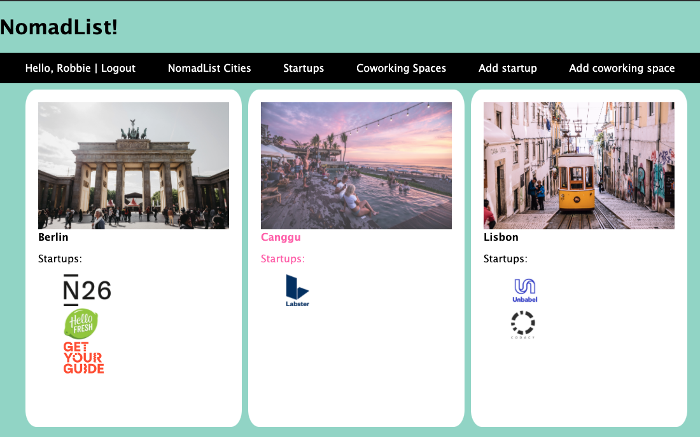
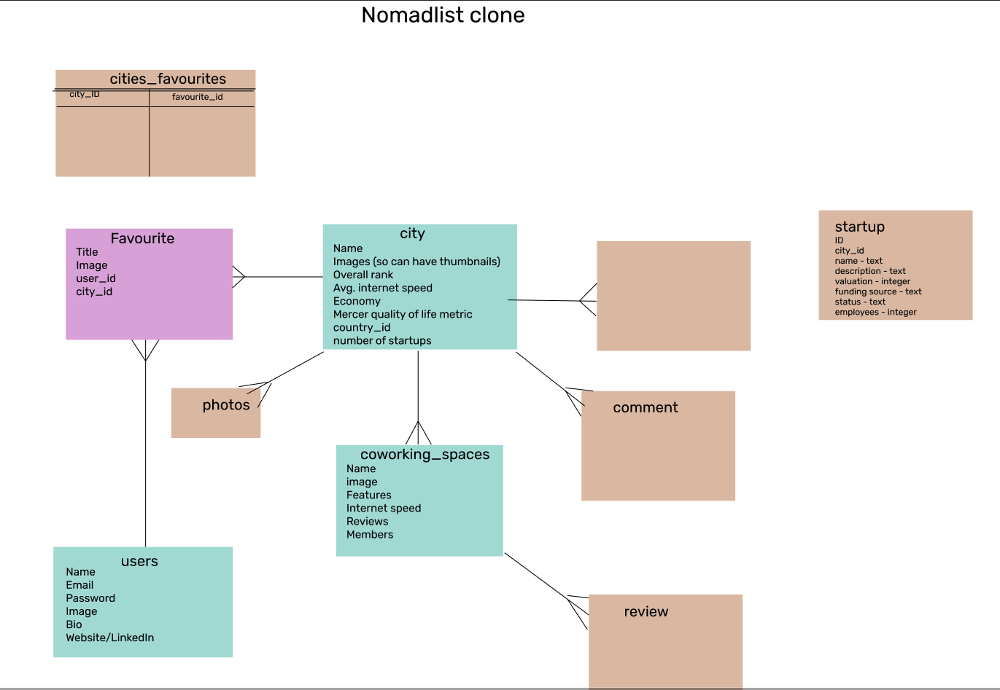

# README

## NomadList - a sharing site for digital nomads

### Features
- Find cities that are ideal for working remotely
- See startups located in each city selected
- Create a user account and log in
- Add a new startup to the site
- Edit existing startups/coworking spaces
- Delete existing startups/coworking spaces

### Technologies

- Ruby on Rails (built with 5.2.4.3) & Ruby (built with 2.7.0)
- HTML5& CSS3
- Node
- Homebrew
- Cloudinary gem
- Heroku

### Setup

To run this project, install it locally using Homebrew.

You can install Ruby, Ruby on Rails and gems run the following commands using Homebrew: 

```
$ brew install ruby
$ brew install node
$ gem install rails -v 5.2.4.3
$ brew tap heroku/brew && brew install heroku
$ gem install cloudinary
```

To install the required gems in rails run: 
```
$bundle install
```

You can then navigate to `localhost:3000`. 

### Deployment

I used Heroku to deploy this project to a live system. 

To deploy, I used the following commands
```
heroku login
heroku create
git add .
git commit -m "Heroku deployment"
git push heroku master
heroku run rails db:migrate
heroku run rails db:seed
heroku open
```

### Screenshot



### Planning stages



### Wish List
Features/functionality I would like to continue adding to this project include:
- Countries & regions tables for grouping cities
- Editing of user profile
- Ability to add comments and reviews to the cities, coworking spaces and startups
- Breadcrumbs on each page for navigation, e.g. region > country > city > startup
- Ability to like cities/startups/coworking spaces, and follow other users
- Add employer category of user so companies can link up with digital nomads

### Contributing
Pull requests welcomed!

### Acknowledgments

* My instructors Luke and Zara at General Assembly who made this project a reality, thank you!
